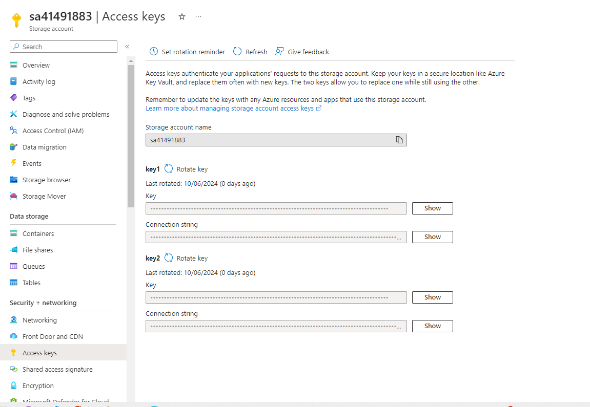

# Develop Generative AI Solutions With Azure OpenAI

## Introduction

Hello everyone! In this blog post, we're going to explore how to create some  applications using the Azure OpenAI SDK. Azure OpenAI brings the power of OpenAI's generative models to the Azure platform, making it easier than ever to integrate advanced AI capabilities into your applications.

We'll guide you through the environment setup and discuss four different scenarios where you can implement a Proof of Concept (PoC) using Azure OpenAI:

1. **Implementing a Proof of Concept (PoC) for Azure OpenAI**: Deploy a GPT-35-turbo-16k model in Azure OpenAI and configure a sample application to connect to the resources.
2. **Developing the PoC App for Company Chatbot**: Explore the potential of Azure OpenAI for company chatbot functionality, focusing on casual tone responses.
3. **Using the PoC App for Developer Tasks**: Utilize the PoC app to assist with developer tasks such as code refactoring and unit testing.
4. **Using Company Data for Travel Recommendations**: Extend the PoC app to utilize company data for providing accurate travel recommendations.

## Environment Setup

First, let's set up a Python environment on our local computer where we'll install our Azure applications. Assuming you have Anaconda installed, follow these steps to create and activate a new environment for our project.

### Step 1: Installation of Conda

If you don't have Anaconda installed, you can download it from the [official website](https://www.anaconda.com/products/distribution). Once Anaconda is installed, create a new environment for our project:


```bash
conda create -n azure python==3.11 ipykernel  
```
then we activate
```bash
 conda activate azure, 
 ```
You can install Jupyter Lab if you like
```bash
pip install jupyter notebook
```

or optionally if you want have  Elyra
```bash
 conda install -c conda-forge "elyra[all]"
```
then

```bash
python -m ipykernel install --user --name azure --display-name "Python 3.11 (Azure)"

```

The Python SDK is built and maintained by OpenAI.

```bash
pip install openai==1.13.3 python-dotenv
pip install openai==1.6.1 python-dotenv
pip install azure-search-documents
pip install azure-core
 
```
We can test our installation of our enviroment by typing

```bash
jupyter lab
```
### Step 2 - Enable Azure OpenAI Service

To build a generative AI solution with Azure OpenAI, the first step is to provision an Azure OpenAI resource in your Azure subscription.

Azure OpenAI Service is currently in limited access. Apply for service access [here](https://aka.ms/oai/access).

**Sign in to the Azure Portal:**
   - Go to the [Azure portal](https://portal.azure.com/) and sign in with your Azure account.

**Create an Azure OpenAI resource:**
   - In the search bar, type "Azure OpenAI" and select it.


   - Click "Create" to create a new Azure OpenAI resource.


   
   - Choose the subscription and resource group.
   - Select the region (ensure it matches the region, In my case I am  in Europe I use  France central).
   - Fill in the required details and create the resource.


and finally click


when finish 


Go to your resource in the Azure portal. The Keys and Endpoint can be found in the Resource Management section. Copy your endpoint and access key; you'll need both for authenticating your API calls. You can use either KEY1 or KEY2. Having two keys allows secure rotation and regeneration without causing service disruption.


and copy the  KEY 1 and Endpoint


**Environment Variables:**
Create and assign persistent environment variables for your key and endpoint. Create a `.env` file and add the environment variables:

```plaintext
AZURE_OAI_KEY="REPLACE_WITH_YOUR_KEY_VALUE_HERE"
AZURE_OAI_ENDPOINT="REPLACE_WITH_YOUR_ENDPOINT_HERE"
```

**Deploy the GPT-3.5-turbo-16k model:**
   - Once the resource is created, navigate to it.


   - In the left-hand menu, click on "Deployments".


   
   - Click "Add" to deploy a new model.
   - Choose "GPT-3.5-turbo-16k" from the model list.
   - In the "Advanced options":
     - Set "Tokens per Minute Rate Limit (thousands)" to 5K.
     - Set "Enable Dynamic Quota" to Disabled.
   - Complete the deployment.


you will have


To test, just click open playgroud, and type something to see if works.


Well done!.

### How to Perform Calls

To make a call against the Azure OpenAI service, you'll need the following information:

| Variable Name | Value |
|---|---|
| ENDPOINT | Found in the Keys and Endpoint section of your resource in the Azure portal. Example: [https://docs-test-001.openai.azure.com/](https://docs-test-001.openai.azure.com/). |
| API-KEY | Found in the Keys and Endpoint section of your resource in the Azure portal. Use either KEY1 or KEY2. |
| DEPLOYMENT-NAME | The custom name you chose for your deployment. Found under Resource Management > Model Deployments in the Azure portal or under Management > Deployments in Azure OpenAI Studio. |


# Example 1

```python
import os
from dotenv import load_dotenv
from openai import AzureOpenAI
load_dotenv()    
client = AzureOpenAI(
    api_key=os.getenv("AZURE_OPENAI_API_KEY"),  
    api_version="2024-02-01",
    azure_endpoint = os.getenv("AZURE_OPENAI_ENDPOINT")
    )
    
deployment_name='REPLACE_WITH_YOUR_DEPLOYMENT_NAME' #This will correspond to the custom name you chose for your deployment when you deployed a model. Use a gpt-35-turbo-instruct deployment. 
    
# Send a completion call to generate an answer
print('Sending a test completion job')
start_phrase = 'Write a tagline for an ice cream shop. '
response = client.completions.create(model=deployment_name, prompt=start_phrase, max_tokens=10)
print(start_phrase+response.choices[0].text)

```

# Example 2

```python
import os
from dotenv import load_dotenv
from openai import AzureOpenAI
from azure.identity import DefaultAzureCredential, get_bearer_token_provider
load_dotenv()
endpoint = os.environ["AZURE_OPENAI_ENDPOINT"]
deployment = os.environ["CHAT_COMPLETIONS_DEPLOYMENT_NAME"]
search_endpoint = os.environ["SEARCH_ENDPOINT"]
search_index = os.environ["SEARCH_INDEX"]
      
token_provider = get_bearer_token_provider(DefaultAzureCredential(), "https://cognitiveservices.azure.com/.default")
      
client = AzureOpenAI(
    azure_endpoint=endpoint,
    azure_ad_token_provider=token_provider,
    api_version="2024-02-01",
)
      
completion = client.chat.completions.create(
    model=deployment,
    messages=[
        {
            "role": "user",
            "content": "Who is DRI?",
        },
        {
            "role": "assistant",
            "content": "DRI stands for Directly Responsible Individual of a service. Which service are you asking about?"
        },
        {
            "role": "user",
            "content": "Opinion mining service"
        }
    ],
    extra_body={
        "data_sources": [
            {
                "type": "azure_search",
                "parameters": {
                    "endpoint": search_endpoint,
                    "index_name": search_index,
                    "authentication": {
                        "type": "system_assigned_managed_identity"
                    }
                }
            }
        ]
    }
)
      
print(completion.to_json())
```

### Scenario 1: Implementing a Proof of Concept (PoC) for Azure OpenAI

In this scenario, we're tasked with deploying a GPT-35-turbo-16k model in Azure OpenAI and configuring a sample application to connect to the resources. This serves as our initial PoC to demonstrate the capabilities of Azure OpenAI.

#### Requirements:
The solution must meet the following requirements:

* Deploy a GPT-35-turbo-16k model in Azure OpenAI in the same region as the resource group.
* Configure the settings file of the PoC app with the connection strings (without adding them directly to the code).
* Configure the client settings for Azure OpenAI in the Main() function (using API version 2023-12-01-preview for Python).
* Configure the messages, API parameters, and call chat completion connection in the function1() function.
* Validate the response using a sample text prompt file.
* Set the Tokens per Minute Rate Limit (thousands) to 5K and Enable Dynamic Quota to Disabled in the Deploy model dialog box.


```python
import os
from dotenv import load_dotenv
import utils
# Add OpenAI import. (Added code)
from openai import AzureOpenAI, Model, ChatCompletion
def main(func):
    try:
        load_dotenv()
        utils.initLogFile()
        azure_oai_endpoint = os.getenv("AZURE_OAI_ENDPOINT")
        azure_oai_key = os.getenv("AZURE_OAI_KEY")
        azure_oai_model = os.getenv("AZURE_OAI_MODEL")
        # Define Azure OpenAI client (Add code here)
        client = AzureOpenAI(azure_endpoint=azure_oai_endpoint, api_key=azure_oai_key, api_version="2024-02-01")
        if callable(func):
            func(client, azure_oai_model)
        else:
            print("Invalid input. Please pass a valid function.")

    except Exception as ex:
        print(ex)

# Task 1: Validate PoC
def function1(aiClient, aiModel):
    inputText = utils.getPromptInput("Task 1: Validate PoC", "sample-text.txt")
    
    # Build messages to send to Azure OpenAI model. (Modified code)
    messages = [
        {"role": "user", "content": inputText}  # Modified to us"user" role and "content" key
    ]
    
    # Define argument list (Modified code)
    apiParams = {
        "model": aiModel,  # Added model parameter
        "messages": messages,
    }
    utils.writeLog("API Parameters:\n", apiParams)
    # Call chat completion connection. (Modified code)

    response = aiClient.chat.completions.create(**apiParams) # Modified to use the aiClient and **apiParams
    utils.writeLog("Response:\n", str(response))
    print("Response: " + response.choices[0].message.content + "\n")
    return response

# Call the main function with function1 as an argument
main(function1)

```

### Scenario 2: Developing the PoC App for Company Chatbot

Here, we'll further develop the PoC app to explore the potential of Azure OpenAI for company chatbot functionality. The goal is to develop an app that provides responses in a casual tone, limited to 1,000 tokens, and with a temperature of 0.5.


### Developing the PoC App for Company Chatbot

We have been tasked with further developing the Proof of Concept (PoC) app to explore the potential of Azure OpenAI for company chatbot functionality. The goal is to develop the app to provide responses in a casual tone, limited to 1,000 tokens, and with a temperature of 0.5.

#### Requirements:

The solution must meet the following requirements:

* Each response must be in a casual tone and end with "Hope that helps! Thanks for using Contoso, Ltd."
* Responses must be limited to 1,000 tokens and the temperature must be 0.5.
* At least one example must be provided with the prompt, such as:
	+ Prompt: Where can I find the company phone number?
	+ Response: You can find it on the footer of every page on our website. Hope that helps! Thanks for using Contoso, Ltd.
* Use prompt engineering techniques to ask the following question and get the response in both English and Spanish:
	+ "What is the best way to find if a company is hiring?"


```python
# Task 2: Company chatbot
def function2(aiClient, aiModel):
    inputText = utils.getPromptInput("Task 2: Company chatbot", "sample-text.txt")
    
    # Build messages to send to Azure OpenAI model. (Added code)
    messages = [
        {"role": "user", "content": inputText},
        {"role": "assistant", "content": "You can find it on the footer of every page on our website. Hope that helps! Thanks for using Contoso, Ltd."}
    ]
    
    # Define argument list (Modified code)
    apiParams = {
        "model": aiModel,
        "messages": messages,
        "temperature": 0.5,
        "max_tokens": 1000
    }
    
    utils.writeLog("API Parameters:\n", apiParams)

    # Call chat completion connection. (Modified code)
    response = aiClient.chat.completions.create(**apiParams) # Modified to use the aiClient and **apiParams
    utils.writeLog("Response:\n", str(response))
    print("Response"+ response.choices[0].message.content + "\n")
    return response

# Call the main function with function2 as an argument
main(function2)    
```

### Scenario 3: Using the PoC App for Developer Tasks

In this scenario, we'll use the PoC app to assist with developer tasks such as code refactoring and unit testing. This demonstrates how Azure OpenAI can enhance productivity and streamline development workflows.

### Using the PoC App for Developer Tasks

We have been tasked with using the Proof of Concept (PoC) app to help with developer tasks, such as code refactoring and unit testing. The goal is to modify th`function3` function of the PoC app to successfully complete the following tasks:

#### Requirements:

The solution must meet the following requirements:

* Take the legacy code in `legacyCode.py`, and generate documentation.
* Generate five unit tests for the function in `fibonacci.py`.
* Modify the prompt in `sample-text.txt` to accomplish each task.
* Submit individual code generation requests for each task to Azure OpenAI using the PoC app.


```python
# Task 3: Developer tasks
def function3(aiClient, aiModel):
    inputText = utils.getPromptInput("Task 3: Developer tasks", "sample-text.txt")
    
    # Build messages to send to Azure OpenAI model. (Added code)
    messages = [
        {"role": "user", "content": inputText},
        {"role": "assistant", "content": ""}  # Initialize response content
    ]
    
    # Define argument list (Modified code)
    apiParams = {
        "model": aiModel,
        "messages": messages,
        "temperature": 0.5,  # Set temperature to 0.5
        "max_tokens": 1000  # Set max tokens to 1000
    }
    
    utils.writeLog("API Parameters:\n", apiParams)

    # Call chat completion connection. (Modified code)
    response = aiClient.chat.completions.create(**apiParams) # Modified to use the aiClient and **apiParams
    
    utils.writeLog("Response:\n", str(response))
    print("Response: " + response.choices[0].message.content + "\n")
    return response

# Call the main function with function2 as an argument
main(function3)  
```


### Scenario 4: Using Company Data for Travel Recommendations

Finally, we'll extend the PoC app to utilize our company's data to better answer customer questions related to travel. The goal is to connect the PoC app to an Azure AI Search resource that contains sample travel data, providing more accurate and relevant responses.


### Using Company Data for Travel Recommendations

We have been tasked with extending the Proof of Concept (PoC) app to use our own company data to better answer customer questions related to travel. The goal is to connect the PoC app to use the search41431948 Azure AI Search resource that contains sample travel data.

#### Requirements:

The solution must the following requirements:

* search41431948 must train on the data in the sa41431948/blob1 Azure Blob Storage container.
* The index must be named pocindex.
* The search type must be Keyword.
* You must use a system message of “You are a helpful travel agent.”
* Configure the search connection strings in the configuration file.
* Send the following request to verify how the model answers the question: “When is the best time to visit London?”


1. **Obtaining the Azure Search API Key:**

   - Log in to the Azure portal (https://portal.azure.com).
   - Navigate to your Azure Search resource. In this case, it's the `search41431948` resource.


   - Once you're in the Azure Search resource, go to the "Keys" section. You can find this in the left-hand menu under "Settings."
   - In the "Keys" section, you'll see two keys: a primary key and a secondary key. Either key will work, but it's recommended to use the primary key.
   - Copy the primary key. This is your `search_api_key`.

2. **Obtaining the Blob Storage Connection String:**

   - Log in to the Azure portal (https://portal.azure.com).
   - Navigate to your Azure Storage account. In this case, it's the storage account associated with `sa41431948`.
   - Once you're in the Storage account, go to the "Access keys" section. You can find this in the left-hand menu under "Settings."
   - In the "Access keys" section, you'll see two keys: a key1 and a key2. Again, either key will work, but it's recommended to use key1.
   - Copy the "Connection string" under key1. This is your `blob_storage_connection_string`.

After obtaining both the `search_api_key` and the `blob_storage_connection_string`, you can replace the placeholders in the code with these values. This ensures that your Python application can authenticate and access the Azure Search service and Blob Storage container.


Here is the completed Python code based on the requests:

```python
from azure.core.credentials import AzureKeyCredential
from azure.search.documents import SearchClient
import os
from dotenv import load_dotenv
from openai import AzureOpenAI
load_dotenv()
search_api_key = os.getenv("SEARCH_API_KEY") #"<your_search_api_key>"
blob_storage_connection_string =os.getenv("CONNECTION_STRING") #"<your_blob_storage_connection_string>"
def function4(aiClient, aiModel):
    # Assuming you have the necessary Azure SDK installed and configured

    # Load configuration file or define connection strings
    search_service_name = "search41431948"
    index_name = "pocindex"
    search_api_key =search_api_key #"<your_search_api_key>"
    blob_container_name = "sa41431948"
    blob_storage_connection_string =blob_storage_connection_string #"<your_blob_storage_connection_string>"

    # Initialize Azure Search client
    search_client = SearchClient(account_url=f"https://{search_service_name}.search.windows.net/",
                                 index_name=index_name,
                                 credential=AzureKeyCredential(search_api_key))

    inputText = utils.getPromptInput("Task 4: Use company data", "sample-text.txt")

    # Build messages to send to Azure OpenAI model
    messages = [
        {"role": "user", "content": inputText}
    ]

    # Define argument list
    apiParams = {
        "model": aiModel,
        "messages": messages,
        "temperature": 0.5,  # Set temperature to 0.5
        "max_tokens": 1000  # Set max tokens to 1000
    }

    utils.writeLog("API Parameters:\n", apiParams)

    # Call chat completion connection.
    response = aiClient.chat.completions.create(**apiParams)
    utils.writeLog("Response:\n", str(response))

    # Extract the user's query
    user_query = response.choices[0].message.content

    # Perform search on Azure AI Search
    search_result = search_client.search(search_text=user_query, top=1)

    if search_result:
        # Extract the first result
        first_result = search_result[0]

        # Extract the system message
        system_message = "You are a helpful travel agent."

        # Build the response message
        response_message = {
            "role": "system",
            "content": f"{system_message} {first_result['your_desired_field']}"  # Update 'your_desired_field' to your desired field from the search result
        }

        # Append the response message to the messages list
        messages.append(response_message)

        # Update apiParams with new messages
        apiParams['messages'] = messages

        # Call chat completion connection again with updated messages
        response = aiClient.chat.completions.create(**apiParams)
        utils.writeLog("Response:\n", str(response))
        print("Response: " + response.choices[0].message.content + "\n")
    else:
        print("No search result found.")

    return response
# Call the main function with function2 as an argument
main(function4) 
```
## Troobleshootings

### Updating Anaconda fails: Environment Not Writable Error

On Windows, search for Anaconda PowerShell Prompt.
Right click the program and select Run as administrator.
In the command prompt, execute the following command:

```bash
conda update -n base -c defaults conda
```
Your Anaconda should now update without admin related errors.

### Removing Conda environment
After making sure your environment is not active, type:

```
conda remove --name azure --all
```


**Conngratulations!**

You could learn how to:  
-  Generate and improve code by using Azure OpenAI
-  Deploy an Azure OpenAI resource and an Azure OpenAI model
-  Apply prompt engineering techniques by using Azure OpenAI
-  Use Azure OpenAI on your data
-  Generate natural language responses by using Azure OpenAI
